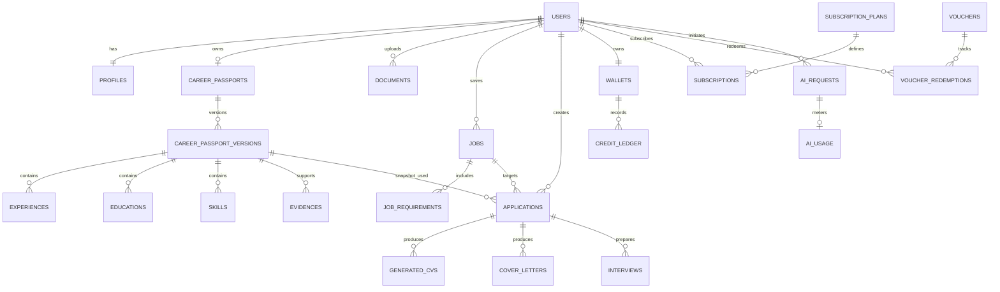

# Logical ERD
This is a starting conceptual diagram, not a migration specification.

```mermaid
erDiagram
 USERS ||--|| PROFILES : has
 USERS ||--o| CAREER_PASSPORTS : owns
 CAREER_PASSPORTS ||--o{ CAREER_PASSPORT_VERSIONS : versions
 CAREER_PASSPORT_VERSIONS ||--o{ EXPERIENCES : contains
 CAREER_PASSPORT_VERSIONS ||--o{ EDUCATIONS : contains
 CAREER_PASSPORT_VERSIONS ||--o{ SKILLS : contains
 CAREER_PASSPORT_VERSIONS ||--o{ EVIDENCES : supports
 USERS ||--o{ DOCUMENTS : uploads
 USERS ||--o{ JOBS : saves
 JOBS ||--o{ JOB_REQUIREMENTS : includes
 USERS ||--o{ APPLICATIONS : creates
 JOBS ||--o{ APPLICATIONS : targets
 CAREER_PASSPORT_VERSIONS ||--o{ APPLICATIONS : snapshot_used
 APPLICATIONS ||--o{ GENERATED_CVS : produces
 APPLICATIONS ||--o{ COVER_LETTERS : produces
 APPLICATIONS ||--o{ INTERVIEWS : prepares
 USERS ||--|| WALLETS : owns
 WALLETS ||--o{ CREDIT_LEDGER : records
 USERS ||--o{ SUBSCRIPTIONS : subscribes
 SUBSCRIPTION_PLANS ||--o{ SUBSCRIPTIONS : defines
 VOUCHERS ||--o{ VOUCHER_REDEMPTIONS : tracks
 USERS ||--o{ VOUCHER_REDEMPTIONS : redeems
 USERS ||--o{ AI_REQUESTS : initiates
 AI_REQUESTS ||--o| AI_USAGE : meters
```
